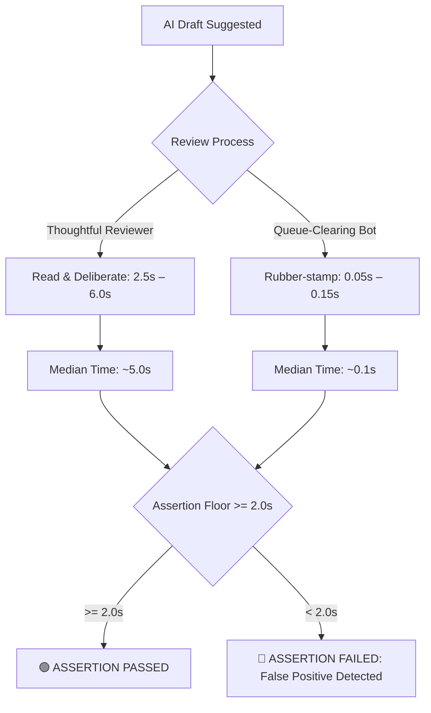

# Metric Pair & Assertion Guard 🛡️

> **An operational control center guarding against false-positive conversion metrics in AI draft generators and copilots.**

[](https://react.dev/)
[](https://vitejs.dev/)
[](https://expressjs.com/)
[](LICENSE)

---

## 📖 Overview & Motivation

When evaluating AI draft assistants (e.g., customer support copilots, sales outreach generators, medical report summarizers), teams conventionally measure success using **Conversion Rate** (the percentage of suggested drafts accepted and sent).

### The "Goodhart's Law" Trap 🪤
> *"When a measure becomes a target, it ceases to be a good measure."* — Goodhart's Law

A **100% conversion rate** appears ideal on executive dashboards. However, if a user or automated script rubber-stamps drafts without reading them, the conversion rate remains a flawless 100%, while quality, accuracy, and safety are entirely compromised.

**The Solution:** Pair **Conversion Rate** with **Median Time-to-Convert** and enforce an **Assertion Floor Threshold** (e.g., $\ge 2.0\text{s}$) to programmatically catch superficial approvals and guarantee genuine cognitive review.



---

## ✨ Key Features

### 1. Three Behavioral Profiles
* **Thoughtful Reviewer (Human Simulation)**: Simulates human reading ($2.5\text{s} - 6.0\text{s}$) and editing ($1.5\text{s} - 4.0\text{s}$), producing realistic conversion rates (~90%) and edit rates (~44%) that comfortably pass the assertion floor.
* **Queue-Clearing Bot (Automated Rubber-stamping)**: Simulates automated sub-second approvals ($0.05\text{s} - 0.15\text{s}$). Exposes the 100% conversion rate trap by triggering immediate **ASSERTION FAILED** alarms.
* **Manual Workspace**: Interactive hands-on review environment with real-time stopwatch timing, quick text polish tools, and draft editing.

### 2. Live Assertion Floor Control
* Configurable floor threshold ($0.5\text{s} - 5.0\text{s}$) with quick preset buttons ($1.0\text{s}$, $2.0\text{s}$, $3.0\text{s}$, $4.0\text{s}$).
* Dynamically re-evaluates all historical sessions in real time.

### 3. Dynamic Scatter Timeline Chart
* Responsive scatter plot built with Recharts.
* **Dynamic Y-Axis Scaling**: Guarantees the red dashed **Assertion Floor** reference line is always visible without clipping, even during sub-second bot simulations.
* **Color-Coded Status**: Green dots for drafts exceeding the floor; red dots for drafts falling below the floor.

### 4. Interactive Manual Workspace & Undo Engine
* **Live Stopwatch Timer**: Ticking millisecond badge tracking active cognitive time.
* **Quick Tools**: `+ Add Polish`, `+ Standard Sign-off`, `Clear Text`.
* **Undo Engine**: Reverts the last processed draft back to pending status and recalculates metrics.
* **Keyboard Shortcuts**: <kbd>Ctrl</kbd>+<kbd>Enter</kbd> to Accept, <kbd>Esc</kbd> to Reject, <kbd>Alt</kbd>+<kbd>Ctrl</kbd>+<kbd>Z</kbd> to Undo.

### 5. Benchmark Matrix & Export
* **Side-by-Side Comparison**: Modal comparing Human Reviewer vs. Queue-Clearing Bot vs. Current Session performance.
* **Session Exporter**: Downloads full audit logs, drafts, and metric history as a `.json` report.
* **Speed Switcher**: Simulation speeds at `1x`, `2x`, `5x`, or `Instant`.

---

## 📐 Mathematical Formulation

### 1. Conversion Rate
$$\text{Conversion Rate} = \left( \frac{N_{\text{converted}} + N_{\text{edited}}}{N_{\text{processed}}} \right) \times 100\%$$

### 2. Edit Rate
$$\text{Edit Rate} = \left( \frac{N_{\text{edited}}}{N_{\text{converted}} + N_{\text{edited}}} \right) \times 100\%$$

### 3. Median Time-to-Convert
For sorted conversion times $[t_1 \le t_2 \le \dots \le t_K]$ of converted drafts:
$$\text{Median} = \begin{cases} t_{(K+1)/2} & \text{if } K \text{ is odd} \\ \frac{t_{K/2} + t_{(K/2)+1}}{2} & \text{if } K \text{ is even} \end{cases}$$

### 4. Assertion Guard Rule
$$\text{AssertionPassed} = \begin{cases} \text{true} & \text{if } K = 0 \\ \text{MedianTimeToConvert} \ge \text{AssertionFloor} & \text{if } K > 0 \end{cases}$$

---

## 🛠️ Tech Stack

* **Frontend**: React 19, Vite 8, Recharts 3, Lucide React
* **Styling**: Vanilla CSS (Custom Design System with Glassmorphism & Dark Mode)
* **Backend**: Node.js, Express 5
* **Tooling**: Oxlint, Concurrently

---

## 🚀 Quick Start

### 1. Prerequisites
* [Node.js](https://nodejs.org/) (v18 or higher recommended)
* npm (v9 or higher)

### 2. Installation
```bash
# Clone or navigate to the project directory
cd metric-assertion-app

# Install dependencies
npm install
```

### 3. Run Development Server
```bash
# Starts both Express backend (port 3001) and Vite frontend (port 5173) simultaneously
npm run dev
```

Open [http://localhost:5173](http://localhost:5173) in your browser.

---

## 🧪 Testing & Verification

```bash
# Run mathematical unit tests and simulation verification
node src/verify-metrics.js

# Run code linter
npm run lint
```

---

## 📂 Project Structure

```
metric-assertion-app/
├── public/                 # Static assets
├── src/
│   ├── App.css             # Design tokens, glassmorphism & component styles
│   ├── App.jsx             # Main dashboard, state machine, and chart UI
│   ├── index.css           # Foundational typography and CSS reset
│   ├── main.jsx            # React root mount
│   └── verify-metrics.js   # Metric calculators and assertion test suite
├── index.html              # HTML entry point with metadata
├── package.json            # Scripts and dependencies
├── server.js               # Express API (state, plan, action, undo, floor endpoints)
├── vite.config.js          # Vite config with backend proxy (/api -> :3001)
└── README.md               # Project documentation
```

---

## 📄 License

This project is licensed under the MIT License.

